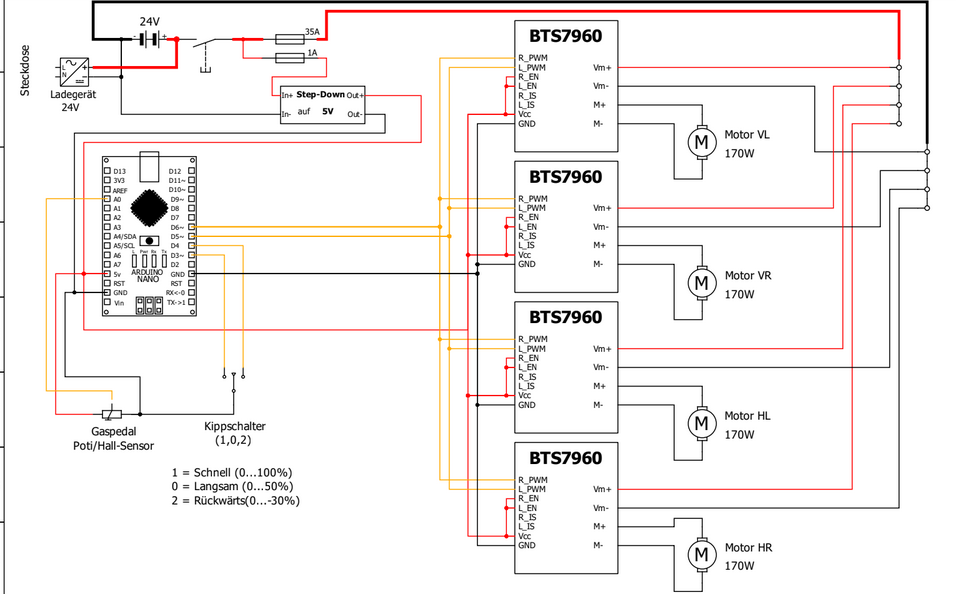

# Four-Wheel-Drive Kids Car (24 V, 4 × BTS7960)

Class-based Arduino driver for the wiring shown in  


## Features
* Drives four BTS7960 H-bridges in parallel
* Three-mode toggle (fast, slow, reverse)
* Throttle via Hall / pot pedal
* Soft start/stop ramp
* Easily portable to any AVR (Nano, Pro Mini, UNO…)

## Quick start

```bash
git clone https://github.com/your-name/my-fourwd-drive.git
cd my-fourwd-drive

# 1) PlatformIO -------------------------------
pio run -t upload          # set your port /env in platformio.ini

# 2) or Arduino-CLI ---------------------------
arduino-cli compile -b arduino:avr:nano:cpu=atmega328
arduino-cli upload -b arduino:avr:nano:cpu=atmega328 -p /dev/ttyUSB0
